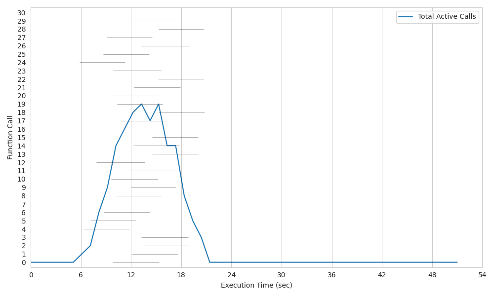

# Lithops for Burst Invocation
This is a fork of the Lithops framework, dedicated exclusively to support burst invocation of functions in a modified version of Apache Openwhisk platform ([https://github.com/CLOUDLAB-URV/openwhisk-burst](https://github.com/CLOUDLAB-URV/openwhisk-burst)). 

Burst invocation pursues native group invocation support into FaaS platforms (more details in link above). With this modified version of Lithops, we can execute a burst of functions, using Lithops as code client and Openwhisk as compute backend.  

## Modifications in this version

> Burst invocation only works with Openwhisk compute backend. Ensure use it.

This version modifies the `map()` and `map_reduce()` funtions of Lithops API. In this fork, these two functions accept a new optional parameter called `burst`:

 - If `burst` is not defined or is equal to `False`, then classic behaviour of the function (N calls to the Openwhisk API, calling functions activation "one by one").
 - If `burst=True`, then Openwhisk is called once (enabling burst mode). Openwhisk will execute the burst of functions.


## Execute the burst
In order to test the burst execution with both Lithops as client and Openwhisk (in its burst version) as compute backend, the list of steps to follow is specified here:

 1. Define Openwhisk (burst version) as the compute backend of the `FunctionExecutor` (via `.config` file or other ways).
 2. Execute `examples/map_burst.py` Python script. 

```python
NUM_ACTIVATIONS = 30 # This value defines number of activations to be spawned in burst mode  
BURST_ENABLED = True # This value defines if burst mode is enabled or not  
  
def my_map_function(id, x):  
  """  
 This function will be executed in burst mode in Openwhisk Sleeps for 5 seconds to simulate a long-running function """  print(f"I'm activation number {id}")  
  time.sleep(5)  
  return x  
  
  
if __name__ == "__main__":  
  iterdata = range(NUM_ACTIVATIONS)  
  fexec = lithops.FunctionExecutor()  
  fexec.map(my_map_function, iterdata, burst=BURST_ENABLED)  
  print(fexec.get_result())  
  fexec.plot()  
  fexec.clean()
  ```

The `map_burst.py` script is above. We can activate or deactivate burst mode and regulate the number of activated functions with constants on the script top.

> Be careful with `runtime_memory!` If you are using burst mode, you must set the runtime memory manually (via `.config` file or other ways). If you don't set it, the default value will be 256MB, and it maybe is not enough for your burst of functions.
 
## Results
We have executed the script below (activating 30 functions) over a single invoker node (with 48 CPU) registered in Openwhisk platform, in both classic and burst configuration. 


<table>
<tr>
<td>

</td>
<td>

</td>
</tr>
<tr>
<td align="center">
Classic configuration
</td>
<td align="center">
Burst configuration
</td>
</tr>
</table>


We can notice that burst configuration is more efficient than classic configuration. The parallelism degree of burst is higher than classic configuration, and also the workload execution time is lower.
